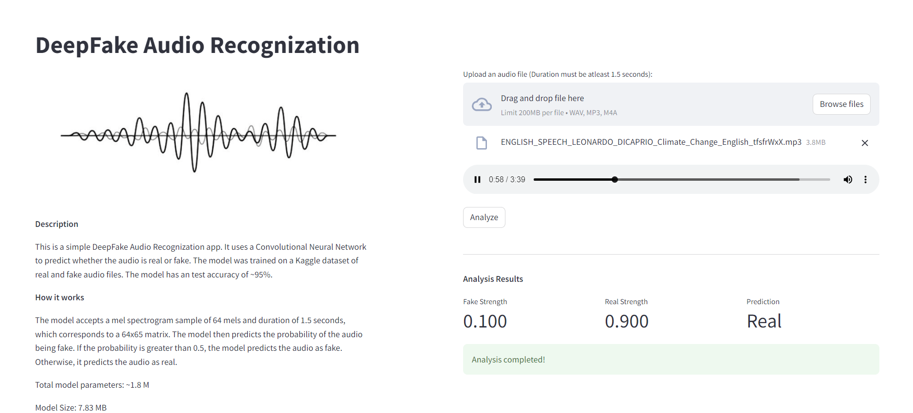

# DeepFake-Audio-Recognition

## Introduction

This is a app that uses Convolutional Neural Network (CNN) to detect real vs deepfake audio. It has acheived a test accuracy of ~95%.

The model accepts mel spectrograms of 64 mels and 1.5 seconds duration (size: 64x65) and gives a single output between 0 and 1, 0 indicating real audio and 1 indicating deepfake audio.

## Dataset

The model is trained on this Kaggle Dataset: [dataset](https://www.kaggle.com/datasets/birdy654/deep-voice-deepfake-voice-recognition)

## Model Specifications

Size of model: **7.83 MB**

No. of model parameters: **~1.8 M**

## Limitations

The model is light-weight and trained on a small portion of the dataset. Hence its accuracy to unforeseen data is very limited. It is still a work in progress, and hence, the size, data and features can be extended with time.

## Deployment

The app is deployed on Streamlit Cloud.

<https://deepfake-audio-recognition.streamlit.app>
